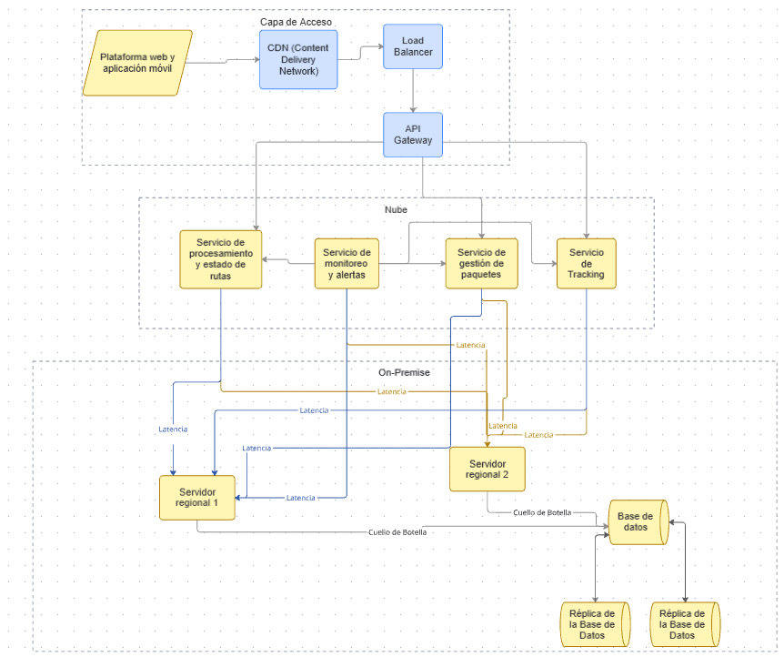

#  Registro de Trabajo en Clase - Taller 4

##  Fecha de la sesión

7 de Marzo

##  Integrantes presentes
- Camilo Arciniegas Guerrero
- Juan Sebastián Ayala
- Juan Diego Campo

## Actividades realizadas en clase

Describa brevemente qué se hizo durante la sesión:

- ¿Qué se discutió con el equipo?
  
  En la clase se discutió la forma en la que debería ser el diagrama de infraestructura, se debatió cuáles eran los puntos de falla en la infraestructura actual de RedExpress
- ¿Qué decisiones de modelado se tomaron?
  
  La decisión más importante de modelado fue migrar de la herramienta de modelación draw.io a la herramienta "Miro".
- ¿Qué herramientas se usaron (papel, pizarra, draw.io, Astah)?
  
  Usamos Miro para el modelado de diagrama de infraestructura
- ¿Qué parte del trabajo se alcanzó a desarrollar?
  
  Boceto inicial del diagrama de infraestructura de RedExpress.

##  Boceto inicial del modelo

##  Tareas definidas para complementar el taller

Anote las responsabilidades acordadas entre los miembros del equipo para completar la entrega final:

| Tarea asignada | Responsable | Fecha estimada |
|----------------|-------------|----------------|
| Modelado del diagrama de parte 1 | Juan Sebastián Ayala | 03/07 |
| Modelado del diagrama de parte 1      | Juan Diego Campo | 03/07 |
| Modelado del diagrama de parte 1  | Camilo Arciniegas | 03/07 |
| Modelado del diagrama de parte 2  | Camilo Arciniegas | 03/11 |
| Redacción del Informe  | Juan Diego Campo | 03/11 |

---

_Este documento resume el trabajo colaborativo realizado durante la sesión del taller 4 en el curso AREM - Universidad de La Sabana._
