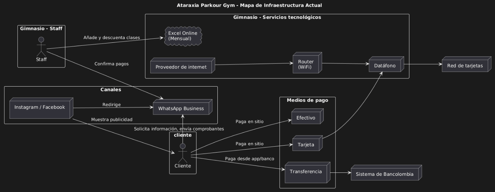

# 📄 Informe Técnico del Taller

## 🔖 Nombre del Taller
_Taller 4 - Mapa de Infraestructura y Diagnóstico Técnico (Cliente: Ataraxia Parkour Gym)_

## 👥 Integrantes del equipo
- Arciniegas Guerrero Camilo
- Ayala Silva Juan Sebastián
- Campo Conde Juan Diego

## 🧠 Descripción general del trabajo
El objetivo del taller es modelar el mapa físico de la infraestructura que soporta la prestación del servicio de Ataraxia Parkour Gym, e identificar debilidades, cuellos de botella y oportunidades de mejora.

## 🔧 Proceso de desarrollo
1. **Definición del sistema a modelar:**
   - No es un software propio único, sino de los con los que ya cuenta el negocio:  
     registro y asistencia, pagos, comunicación con clientes y gestión de documentos (incl. consentimientos/asunción de riesgo).
2. **Modelado del mapa de infraestructura:**
   - Se modeló con: sedes físicas + servicios en la nube + servicios externos (notificaciones/pagos/redes).
3. **Diagnóstico técnico:**
   - Se evaluaron riesgos del emprendimiento con múltiples sedes:  
     fallos que no se pueden controlar (internet/dispositivos), pérdida de datos al manejarse en Excel y no tener continuidad (backups), y capacidad para crecer (escalabilidad).

## 🧩 Análisis del modelo propuesto

### 1) Estructura del modelo
El mapa se organizó en 2 partes:
- **Gimnasio - Staff:** Personal del gimnasio.
- **Gimnasio - Servicios tecnológicos:** Internet, datáfonos, sistema de Excel online.
- **Canales:** WhatsApp Business.
- **Medios de pago:** Efectivo, tarjeta o transferencia (a Bancolombia).

### 2) Cómo se representan las necesidades del cliente:
**Canales de comunicación**
- Cliente: redes sociales y WhatsApp Business.
- Administración: sistema de Excel.
- Profesores: registro de asistencia.

**Flujo**
- Pago de clases → Comprobante de pago → Agregación manual a Excel.
- Registro de asistencias en Excel → Descontar una clase total.

### 3) Supuestos:
Se asume:
- Uso de canales digitales (Instagram/Facebook/WhatsApp) para marketing y comunicación.
- Inclusión de WhatsApp **Business** en este canal para pagos y atención.
- Uso de Excel online para tener registros necesarios por el mes.
- Pagos por transferencia (a Bancolombia), efectivo o tarjeta.
- Consentimiento informado / asunción de riesgos para la práctica deportiva.

## 📈 Diagrama final entregado

## 📋 Tabla de actores, entidades o componentes

| Nombre del elemento | Tipo | Descripción | Responsable |
|---------------------|------|-------------|-------------|
| Cliente | Actor | Solicita información, paga clases y envía comprobantes; asiste a entrenamientos | Cliente |
| Gimnasio - Staff | Actor | Confirma pagos, registra en Excel, atiende WhatsApp, controla saldo de clases | Staff |
| Profesor | Actor | Registra asistenciapara descontar clases en el registro | Staff |
| Proveedor de internet | Infraestructura | Conectividad base para datáfono y Excel Online | Staff |
| Router | Infraestructura | Red que habilita conexión de dispositivos y datáfono | Staff |
| Datáfono | Componente | Para cobro con tarjeta | Staff |
| Excel Online | Servicio Cloud | Registro mensual de pagos, asistencias y saldo de clases | Staff |
| WhatsApp Business | Canal/Servicio | Canal de atención, coordinación y envío de evidencias | Tercero |
| Instagram/Facebook | Canal | Captación de clientes y contacto inicial | Tercero |
| Bancolombia | Servicio Externo | Procesa transferencias | Tercero |
| Sistema de tarjetas | Servicio Externo | Autoriza transacciones del datáfono | Tercero |

## 🔍 Investigación complementaria
### Tema investigado:
**Implementación de sistemas completos en emprendimientos**

### Resumen:
En emprendimientos, “implementar un sistema completo” suele significar pasar de operación fragmentada (mensajería + archivos + registros manuales) a un ecosistema integrado que soporte el ciclo completo del negocio: captación → inscripción/reserva → pago → asistencia → soporte → reportes. La evidencia sobre adopción de sistemas tipo ERP/gestión, muestra que el éxito depende menos de la tecnología “más avanzada” y más de cómo se gestiona el cambio: definición de procesos, roles y datos.

Una ruta realista en emprendimientos es implementar por fases:

1. Delimitar procesos críticos y alcance (MVP operativo)
Identificar qué debe quedar junto siempre (por ejemplo: pagos + saldo de clases + asistencia). Esto evita digitalizar caos.

2. Estandarizar datos y responsabilidades (gobernanza mínima)
Crear un identificador único por cliente, reglas de registro (quién edita, cuándo, cómo se valida un pago) y criterios de calidad del dato; la literatura de PYMES resalta la calidad de datos y la claridad de roles como factores críticos.

3. Pruebas + capacitación + ajuste de procesos
Los estudios sobre la implementación reiteran factores importantes como: apoyo de dirección, gestión del proyecto y participación de usuarios.

## 📚 Referencias

CISA. (s. f.). Small and Medium-Sized Business Resources. Disponible en: https://www.cisa.gov/audiences/small-and-medium-businesses/secure-your-business/smb-resources?utm_source=chatgpt.com
National Institute of Standards and Technology. (2024). NIST CSF 2.0: Small Business Quick Start Guide (SP 1300). Disponible en: https://nvlpubs.nist.gov/nistpubs/SpecialPublications/NIST.SP.1300.pdf?utm_campaign=offer-grid-a-quick-start-guide-for-small-biz-cyber-resilience-issue-no-19&utm_medium=referral&utm_source=chatgpt.com
Google Cloud. (2024). Well-Architected Framework: Reliability pillar. Disponible en: https://docs.cloud.google.com/architecture/framework/reliability?utm_source=chatgpt.com

_Este documento hace parte de la entrega del Taller 4 del curso AREM (Arquitectura Empresarial) - Universidad de La Sabana._
